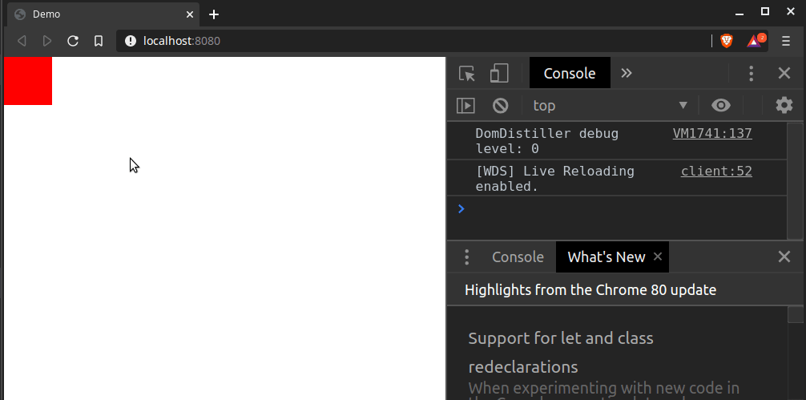

# nopun-ecs

> An Entity-Component-System implementation in Typescript with no pun in its package name

## Background

### What is ECS?

ECS is short for Entity-Component-System, which is a popular, modern architectural pattern used in game development. At its core ECS is an object-oriented pattern, but it strongly favors composition over inheritance and separation of data from logic.

A **component** is a simple data container. It can represent simple concepts like a position in 2D space, the player's health or something more complex like an RPG inventory. The important thing is, that it just holds data. ECS components are also not to be confused with React components or web components - the terms are radically different from each other.

An **entity** is a distinct object in a game. This could be a character, an obstacle, a platform, a bullet - you name it. The entity is a container for a set of components. A character entity for example might consist of a position component, a sprite component and a velocity component. Entities are only references, they do not hold any data of their own.

A **system** manipulates component data by querying for entities based on their components. Example: A system might query for anything that has a position component and a velocity component and then updates the position based on the velocity. The system is completely indifferent as to what the specific entities represent, it only cares for the components involved.

With these concepts ECS allows for very efficient code reuse, because behaviors are not bound to specific classes, but emerge from a combination of atomic components and systems. This not only makes it easier to introduce new ideas to an existing game, but also to share code across multiple projects.

nopun-ecs also introduces the concept of **scenes** on top of the ECS vocabulary. Scenes define a context boundary within which entities and systems exist (other ECS implementations might this `world`). Multiple scenes can be stitched together to form a tree structure, which allows for complexer game designs.

For more on the awesome ECS architecture, checkout the following article: https://medium.com/ingeniouslysimple/entities-components-and-systems-89c31464240d

### About this project

This is a pet project of mine. I started it as an excercise in software architecture, to see how well I could translate the theory of ECS into practice using my favorite language and platform.

As of right now, I do not intend to use it in production. Therefore, I took no measures to make it cross-browser compatible and I rely heavily on ES2020 platform features, which probably makes it a non-starter for most contemporary professional use cases.

I took a lot of inspiration from the [Mozilla ECSY](https://ecsy.io/) project, which you definitely should check out, if you plan on doing anything professional.

## Installation

With npm:

```sh
npm install --save nopun-ecs
```

With yarn:

```sh
yarn add nopun-ecs
```

This package provides its own typescript type definitions.

## Basic Usage

> For more advanced API docs see: [docs/API.md](docs/API.md)

The following example will demonstrate how to implement a simple object that will move on keyboard input. It does not show any advanced rendering techniques and if you plan on writing an actual game, you should use a library like [pixi.js](https://www.pixijs.com/) to do the graphics part.

One of the many benefits of the ECS architecture is, that it is not bound to a specific rendering technique, but could be used in a lot of different environments.

### Step 1 - The HTML file

We create an HTML file that will display a red box. This box will be the object, that will be movable by keyboard input.

```html
<!doctype html>
<html>
    <head>
        <title>Demo</title>
        <style>
            body {
                position: relative;
                padding: 0;
                margin: 0;
            }

            #object {
                position: absolute;
                width: 60px;
                height: 60px;
                background-color: #ff0000;
            }
        </style>
        <script src="path/to/main.js"></script>
    </head>
    <body>
        <div id="object"></div>
    </body>
</html>
```

### Step 2 - Setting up the required components

For the Typescript part of our example, we first need a couple of components that hold the relevant data for us. Since we want an object to move, that object must have a position and a velocity. In order to translate those properties to the screen, the object also needs a reference to its associated DOM node.

```typescript
/* COMPONENTS */
class Position2D {
    // Components are just plain objects that hold data
    x: number = 0;
    y: number = 0;
}

class Velocity2D {
    // Strictly speaking, Velocity2D is a 2D Vector,
    // just like Position2D. But since components are identified
    // by their classes and an entity can only hold one component
    // instance per component class, we do not re-use classes at
    // this point.
    //
    // I even chose to give the properties of Velocity2D different
    // names from those of Position2D, because in my experience
    // this makes both components easier to use later on.
    vx: number = 0;
    vy: number = 0;
}

class DOMNodeReference {
    // We are going to need a reference to the dom node we set up
    // in our HTML file, in order to manipulate it later on.
    node: HTMLElement;
}
```

### Step 2 - Setting up the input system

Like most games, our example is going to be processed sequentially on a frame-by-frame basis. Each execution cycle of the ECS calculates 1 frame.

Unfortunately, this is not how input events are usually handled in the browser, so we need a way to remedy that.

Our Input System is going to remember every keystroke and remove that information again when a key is released. This way, we can ask the store on every frame, which key is currently pressed.

Then we have a look at the arrow keys and transform "ArrowUp", "ArrowDown", "ArrowLeft" and "ArrowRight" to the correct velocity value for our entity.

```typescript
import { System } from "nopun-ecs";

/* COMPONENTS */
class Position2D {/* ... */}
class Velocity2D {/* ... */}
class DOMNodeReference {/* ... */}

/* SYSTEMS */
class InputSystem extends System {
    // Every system can provide a static `queries` property that contains
    // a hashmap of filter arrays. The results of these queries will be
    // available under e.g. `this.queries.movables` in the execute method
    // of the system.
    static queries = {
        // We want every entity, that has a `Velocity2D` component.
        movables: [Velocity2D]
    };

    // Here we are going to store all key presses. Doing so is not
    // ECS-specific but specific to this example.
    private readonly keysPressed = new Set<string>();

    // Every system can provide an `initialize` method, which will be called
    // whenever a system is registered to a scene. We'll use this method
    // do register our DOM event handlers.
    initialize() {
        document.addEventListener("keydown", (event: KeyboardEvent) => {
            // Add the pressed key to our set
            this.keysPressed.add(event.key);
        });

        document.addEventListener("keyup", (event: KeyboardEvent) => {
            // Remove the released key from our set
            this.keysPressed.delete(event.key);
        });
    }

    // Every system must provide an `execute` method. here's where we
    // implement our logic. `execute` is called on every frame in our
    // game, so at 60fps it is called 60 times per second.
    execute() {
        // We loop through the query results of the movables query we
        // defined above.
        for (const movable of this.queries.movables.all) {
            // This is how we can access the data stored in the
            // `Velocity2D` component of our movable entity.
            const velocity = movable.get(Velocity2D);

            if (this.keysPressed.has("ArrowUp")) {
                velocity.vy = -1;
            } else if (this.keysPressed.has("ArrowDown")) {
                velocity.vy = 1;
            } else {
                velocity.vy = 0;
            }

            if (this.keysPressed.has("ArrowLeft")) {
                velocity.vx = -1;
            } else if (this.keysPressed.has("ArrowRight")) {
                velocity.vx = 1;
            } else  {
                velocity.vx = 0;
            }
        }
    }
}
```
### Step 3 - Setting up the movement System

Next we need a system that updates every entity that has a position and a velocity, for the velocity change in step 2 to take effect.

```typescript
import { System } from "nopun-ecs";

/* COMPONENTS */
class Position2D {/* ... */}
class Velocity2D {/* ... */}
class DOMNodeReference {/* ... */}

/* SYSTEMS */
class InputSystem extends System {/* ... */}

class MovementSystem extends System {
    static queries = {
        // Now we want to query every entity, that has a `Velocity2D` and a
        // `Position2D` component.
        movables: [Velocity2D, Position2D]
    };

    // The execute method always receives the current frame delta time,
    // which allows us to calculate stable movement regardless of the
    // underlying performance.
    //
    // For more on that see: https://medium.com/@dr3wc/understanding-delta-time-b53bf4781a03
    execute(dt: number) {
        for (const movable of this.queries.movables.all) {
            // We retrieve both velocity and position from our
            // entities
            const position = movable.get(Position2D);
            const velocity = movable.get(Velocity2D);

            // And then we update the position based on the
            // velocity
            position.x += dt * velocity.vx;
            position.y += dt * velocity.vy;
        }
    }
}
```

### Step 4 - Setting up the rendering system

The last system will take care of translating the position of our entity to its DOM node, so we can see the change on screen.

```typescript
import { System } from "nopun-ecs";

/* COMPONENTS */
class Position2D {/* ... */}
class Velocity2D {/* ... */}
class DOMNodeReference {/* ... */}

/* SYSTEMS */
class InputSystem extends System {/* ... */}
class MovementSystem extends System {/* ... */}

class ObjectsRenderer extends System {
    static queries = {
        // This system can render any entity that has a `Position2D`
        // and a `DOMNodeReference` component
        renderables: [Position2D, DOMNodeReference]
    };

    execute() {
        for (const renderable of this.queries.renderables.all) {
            const { x, y } = renderable.get(Position2D);
            const { node } = renderable.get(DOMNodeReference);

            // Sync position with our DOM node styles. We're using transforms
            // here, because it should be more performant than just using
            // absolute positioning - but we shouldn't rely on DOM rendering
            // in any performance-critical scenario anyway.
            //
            // This is just for demo purposes!
            node.style.transform = `translateX(${x}px) translateY(${y}px)`;
        }
    }
}
```

### Step 5 - Setting up the scene

Now we have all the parts in place and it is time to stitch them together. We create a scene and register our 3 systems to it. Then we create an entity and add all 3 of our components to it.

```typescript
import { System, Scene } from "nopun-ecs";

/* COMPONENTS */
class Position2D {/* ... */}
class Velocity2D {/* ... */}
class DOMNodeReference {/* ... */}

/* SYSTEMS */
class InputSystem extends System {/* ... */}
class MovementSystem extends System {/* ... */}
class ObjectsRenderer extends System {/* ... */}

/* SCENE */
const scene = new Scene();

// The order in which we register our systems matters. Systems are
// executed in the order they've been registered.
scene.systems.register(InputSystem);
scene.systems.register(MovementSystem);
scene.systems.register(ObjectsRenderer);

// Now we create our entity and apply our components to it.
scene.entities.create()
    .add(Position2D)
    .add(Velocity2D)
    .add(DOMNodeReference, {
        // We can initialize components upon adding them
        node: document.getElementById('object')!
    });
```

### Step 5 - Setting up the game loop

Last but not least we implement a basic game loop using `requestAnimationFrame` and execute our scene within that loop.

```typescript
import { System, Scene } from "nopun-ecs";

/* COMPONENTS */
class Position2D {/* ... */}
class Velocity2D {/* ... */}
class DOMNodeReference {/* ... */}

/* SYSTEMS */
class InputSystem extends System {/* ... */}
class MovementSystem extends System {/* ... */}
class ObjectsRenderer extends System {/* ... */}

/* SCENE */
const scene = new Scene();

/* ... */

// We need to calculate the delta time on our own, so
// we capture the timestamp at the beginning
let start = Date.now();
function run() {
    const current = Date.now();
    const delta = current - start; // Manual calculation of delta
    start = current;

    // Execute the scene - this will call the execute method of
    // all systems in sequence.
    scene.execute(delta);

    // Continue the loop on the next animation frame
    requestAnimationFrame(run);
}

run();
```

### Done!

The result should look like this:



You can checkout the full example, including the necessary build setup, here: [examples/basic](examples/basic)

## Contribution / Feedback / Maintenance

As stated above, this is a hobby project. I consider v1.0.0 to be pretty much stable. I'll do my best to stick to semantic versioning, but this is best promise I can make. I won't fix bugs for older versions and major releases might happen rapidly.

If however you'd like to contribute ideas, performance improvements and/or bugfixes, feel free to open an issue or better yet: a Pull Request. I can't guarantee a quick response time, but I am always eager to learn, how the stuff I've made can be improved.

If for whatever reason you'd like to use this library in a professional setup, but want to be little bit more on the safe side regarding maintenance, then there are 2 ways to go about this:

A: I wouldn't mind you forking this project and making it the basis for your own ECS implementation. There's no need for any attribution, but a little heads-up would be appreciated.

B: Depending on your use-case, I might be willing to hand over maintenance of this repository to you, including the npm namespace. The only condition would be, that this project stays open source (the project you are using it for however does not have to be).

## LICENSE

see [LICENSE](./LICENSE)
