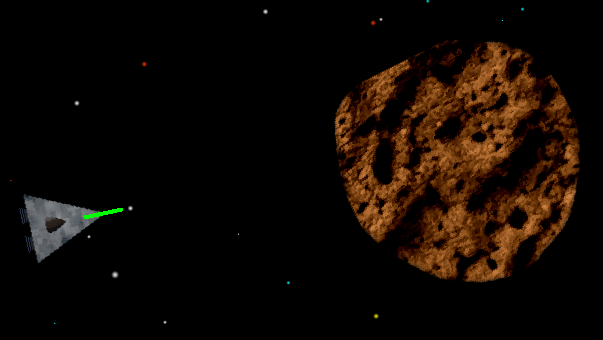

# nopun-ecs - Advanced Example: Ultimate Spacerock Eliminator 9000



> A web based clone of [Asteroids (1979)](https://en.wikipedia.org/wiki/Asteroids_(video_game)) built with [pixi.js](https://www.pixijs.com/) for graphics, [howler.js](https://howlerjs.com/) for sound, [detect-collisions](https://github.com/Prozi/detect-collisions#readme) for Collision Detection and nopun-ecs for logic.

[**Play now!**](https://grebaldi.github.io/nopun-ecs/examples/space-rock-eliminator-9000/index.html)

## About this example

I'm not an expert on game development, but I wanted to provide an example of how to use nopun-ecs for an actual playable game. I chose *Asteroids* as a basis, because I could easily model it in my head.

The game works, but I'm pretty sure that the code offers lots of room for improvement that anybody with more experience in game development will notice. If so, please let me know! I'm always eager to learn :)

Nevertheless, this example demonstrates how to use nopun-ecs to model a game with a decisive set of features:

* Multiple different entities
* A minimal amount of 2D Physics
* Collision Detection
* Graphics
* Sound & Music

The entire code base is commented for you to go ahead, browse the source files and follow along how this was done.

## How to run

1. Clone the nopun-ecs github repository @ https://github.com/grebaldi/nopun-ecs.git
2. Install the dependencies via `yarn`
3. `cd` into `examples/ultimate-space-rock-eliminator-9000/`
4. Install those dependencies via `yarn`
5. Run `yarn start`

Here's a shell snippet that should to the trick:

```sh
git clone https://github.com/grebaldi/nopun-ecs.git
cd nopun-ecs/
yarn
cd examples/ultimate-space-rock-eliminator-9000/
yarn
yarn start
```
